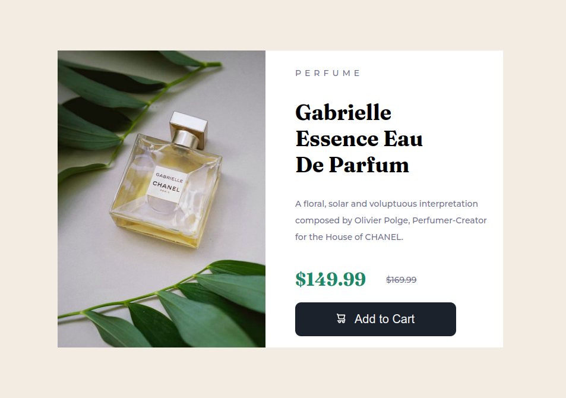

# Frontend Mentor - Product preview card component solution

This is a solution to the [Product preview card component challenge on Frontend Mentor](https://www.frontendmentor.io/challenges/product-preview-card-component-GO7UmttRfa). Frontend Mentor challenges help you improve your coding skills by building realistic projects. 

## Table of contents

- [Overview](#overview)
  - [The challenge](#the-challenge)
  - [Screenshot](#screenshot)
  - [Links](#links)
- [My process](#my-process)
  - [Built with](#built-with)
  - [What I learned](#what-i-learned)
  - [Continued development](#continued-development)
  - [Useful resources](#useful-resources)
- [Author](#author)
- [Acknowledgments](#acknowledgments)

**Note: Delete this note and update the table of contents based on what sections you keep.**

## Overview

### The challenge

Users should be able to:

- View the optimal layout depending on their device's screen size
- See hover and focus states for interactive elements

### Screenshot




**Note: Delete this note and the paragraphs above when you add your screenshot. If you prefer not to add a screenshot, feel free to remove this entire section.**

### Links

- Solution URL: [Add solution URL here](https://your-solution-url.com)
- Live Site URL: [Add live site URL here](https://your-live-site-url.com)

## My process

### Built with

- Semantic HTML5 markup
- CSS3

### What I learned

I learned about the overflow hidden property as it helped me keep the picture in the div after I floated the image to the left of the div.
<br>

```css
.main {
  overflow: hidden;
}
```
<br>
I also learned about the css :before pseudo-selector as it helped me place the cart svg icon beside the text.
<br>

```css
.btn:before {
    content: url("../images/icon-cart.svg");
    width: 10px;
    float: left;
    margin-right: 20px;
}
```

### Continued development

I would love to perfect my responsive design skills so that I will be able to build designs that will be useable across multiple devices.
<br>
I would also love to be able to use the css sizing units skillfully.

### Useful resources

- [Resource 1](https://convertingcolors.com/) - The helped me convert the hsl color values to hex values. I needed the hex values to specify the button color on the css button generator site.

- [Resource 2](https://css3buttongenerator.com/) - This site helped me generate the add to cart button code automatically by just selecting your button design preference without writing any code.

- [Resource 3](https://stackoverflow.com/questions/49997745/how-to-add-svg-icon-to-a-button-with-a-text) - This stack overflow answer helped me understand how to place svg icon to a button with a text.

- [Resource 4](https://stackoverflow.com/questions/369448/keeping-an-floated-image-inside-the-div-with-css) - This stack overflow answer helped me understand how to keep a floated image inside a div using the overflow hidden property.

## Author

- Website - [Emmanuel Julius](https://www.your-site.com)
- Frontend Mentor - [@yourusername](https://www.frontendmentor.io/profile/yourusername)
- Twitter - [@Julius_Java00](https://www.twitter.com/Julius_Java00)