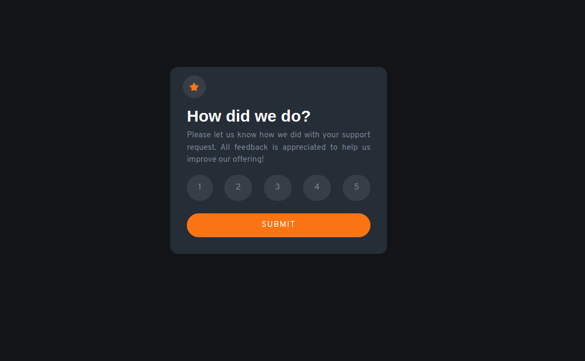
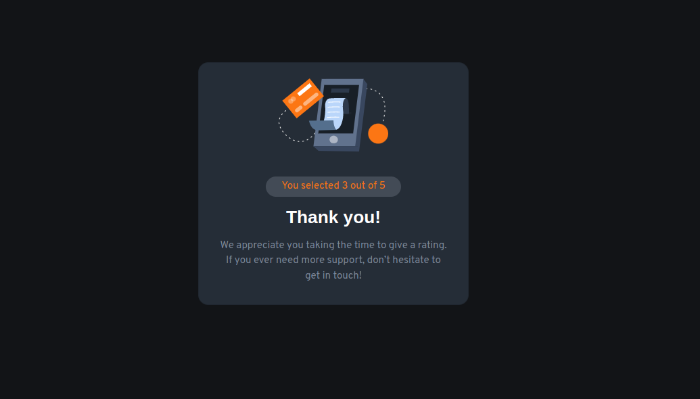

# Frontend Mentor - Interactive rating component solution

This is a solution to the [Interactive rating component challenge on Frontend Mentor](https://www.frontendmentor.io/challenges/interactive-rating-component-koxpeBUmI). Frontend Mentor challenges help you improve your coding skills by building realistic projects. 

## Table of contents

- [Overview](#overview)
  - [The challenge](#the-challenge)
  - [Screenshot](#screenshot)
  - [Links](#links)
- [My process](#my-process)
  - [Built with](#built-with)
  - [What I learned](#what-i-learned)
  - [Continued development](#continued-development)
  - [Useful resources](#useful-resources)
- [Author](#author)
- [Acknowledgments](#acknowledgments)

## Overview

### The challenge

Users should be able to:

- View the optimal layout for the app depending on their device's screen size
- See hover states for all interactive elements on the page
- Select and submit a number rating
- See the "Thank you" card state after submitting a rating

### Screenshot


- Deskop View


- Thank You State View

### Links

- Solution URL: [Add solution URL here](https://your-solution-url.com)
- Live Site URL: [Add live site URL here](https://your-live-site-url.com)

## My process

### Built with

- Semantic HTML5 markup
- CSS custom properties
- Flexbox
- Mobile-first workflow
- [jQuery](https://jquery.com/) - JS library
- [Boostrap 5 cards](https://getbootstrap.com/docs/5.0/getting-started/introduction/) - For card-like style


### What I learned

I learned more about jQuery implementation, like how the '$(this) object placeholder' doesn't work in a nested function except it is stored in a variable.

I also learned how to implement the w3.CSS framework animation, which I did for the thank you page.


```html
  <picture class="thank-you w3-animate-top">
    
  </picture>
```

```js
  rateNumber = $(this).text()
  $(this).addClass("rate-click")
  const btn = $(this)
  setTimeout(function () {
      btn.removeClass("rate-click")
  }, 1500)
```


### Continued development

I would like to become better at responsive designs as well as integrating complex logic for better user interaction

### Useful resources

- [w3.CSS framework animation](https://www.w3schools.com/w3css/w3css_animate.asp) - This helped me implement some animation on the thank you page

## Author
- Frontend Mentor - [@Julius-Java](https://www.frontendmentor.io/profile/Julius-Java)
- Twitter - [@Julius_Java00](https://www.twitter.com/Julius_Java00)

## Acknowledgments

Thank you very much, your review was exremely helpful @Eloagbawe
