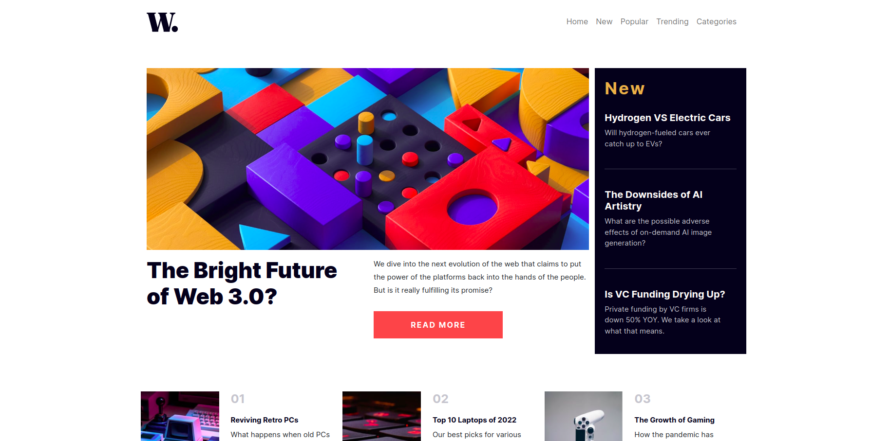
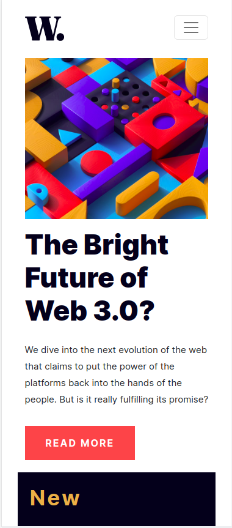
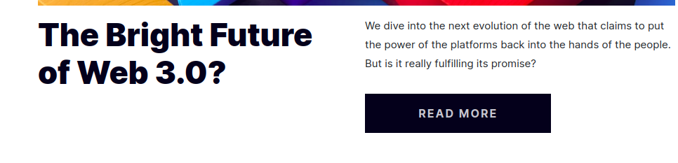

# Frontend Mentor - News homepage solution

This is a solution to the [News homepage challenge on Frontend Mentor](https://www.frontendmentor.io/challenges/news-homepage-H6SWTa1MFl). Frontend Mentor challenges help you improve your coding skills by building realistic projects. 

## Table of contents

- [Overview](#overview)
  - [The challenge](#the-challenge)
  - [Screenshot](#screenshot)
  - [Links](#links)
- [My process](#my-process)
  - [Built with](#built-with)
  - [What I learned](#what-i-learned)
  - [Continued development](#continued-development)
  - [Useful resources](#useful-resources)
- [Author](#author)
- [Acknowledgments](#acknowledgments)

**Note: Delete this note and update the table of contents based on what sections you keep.**

## Overview

### The challenge

Users should be able to:

- View the optimal layout for the interface depending on their device's screen size
- See hover and focus states for all interactive elements on the page


### Screenshot







### Links

- Solution URL: [Add solution URL here](https://your-solution-url.com)
- Live Site URL: [Add live site URL here](https://your-live-site-url.com)

## My process

### Built with

- Semantic HTML5 markup
- CSS custom properties
- Flexbox
- CSS Grid
- CSS media-queries
- Mobile-first workflow
- [React](https://getbootstrap.com/) - Boostrap
- For styles


### What I learned

In the process of doing this project, I learned how to use the boostrap styling components and utilities, I learned about the html picture element and how it helps with displaying responsive images

```html
<picture>
  <source srcset="" media="()" type="">
  
</picture>
```
```css
@media only screen and (width:) {
  ...
}
```

### Continued development

While I learned quite a lot about responsive designs, I definitely need to perfect it as I'm still having issues with mobile responsiveness.

### Useful resources

- [Example resource 1](https://getbootstrap.com/docs/5.0/layout/containers/) - This helped me with making my container divs more reponsive

## Author

- Frontend Mentor - [@Julius-Java](https://www.frontendmentor.io/profile/Julius-Java)
- Twitter - [@Julius_Java00](https://www.twitter.com/Julius_Java00)
- Github - [@Julius-Java](https://www.twitter.com/Julius-Java)
- Website - [Coming soon...](https://www.your-site.com)


## Acknowledgments

I would like to appreciate Dr. Angela Yu for coming up with such an amazing and insightful course [The Complete Web Development Bootcamp](https://www.udemy.com/course/the-complete-web-development-bootcamp/learn/lecture/)  as the knowledged gained for it helped me alot in the project.
@https://github.com/angelabauer