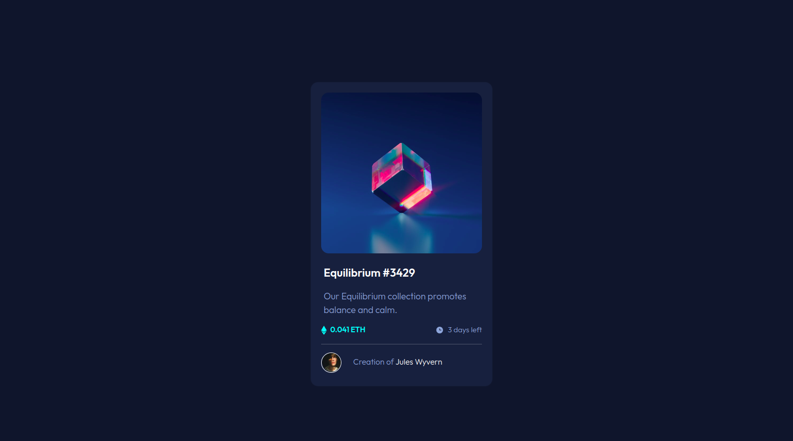
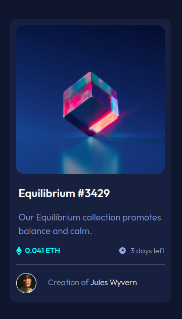

# Frontend Mentor - NFT preview card component solution

This is a solution to the [NFT preview card component challenge on Frontend Mentor](https://www.frontendmentor.io/challenges/nft-preview-card-component-SbdUL_w0U). Frontend Mentor challenges help you improve your coding skills by building realistic projects. 

## Table of contents

- [Overview](#overview)
  - [The challenge](#the-challenge)
  - [Screenshot](#screenshot)
  - [Links](#links)
- [My process](#my-process)
  - [Built with](#built-with)
  - [What I learned](#what-i-learned)
  - [Continued development](#continued-development)
  - [Useful resources](#useful-resources)
- [Author](#author)


## Overview

### The challenge

Users should be able to:

- View the optimal layout depending on their device's screen size
- See hover states for interactive elements

### Screenshot


- Desktop View


- Mobile View

### Links

- Solution URL: [Frontend Mentor](https://www.frontendmentor.io/solutions/nft-preview-card-component-lkTG54bCsW)
- Live Site URL: [Github pages](https://julius-java.github.io/WebDev-Project-00/nft-preview-card-component/index.html)

## My process

### Built with

- Semantic HTML5 markup
- CSS custom properties
- Flexbox
- CSS Grid
- [Boostrap Card Component](https://getbootstrap.com/docs/5.0/components/card/#about)


### What I learned

I learned more about the CSS flex property, and how items are aligned within a flexbox

```css
.price-section {
    margin-top: 10px;
    display: flex;
}

.eth-info, .time-left {
    display: flex;
    align-items: center;
    flex-direction: row;
}
```

### Continued development
I still need to practice more with the flex property and how it manipulates element to master how to use it well

### Useful resources

- [Resource 1](https://www.w3schools.com/howto/tryit.asp?filename=tryhow_css_image_overlay_fade) - This helped me with the main image hover effect, it was a new challenge for me and it help me find my way around it.

- [Resource 2](https://codepen.io/mobas/pen/YRVZZy) - This codepen example helped me place align my eth and clock icon vertically with their respective paragraph tags

## Author
- Frontend Mentor - [@Julius-Java](https://www.frontendmentor.io/profile/Julius-Java)
- Twitter - [@Julius_Java00](https://www.twitter.com/Julius_Java00)

